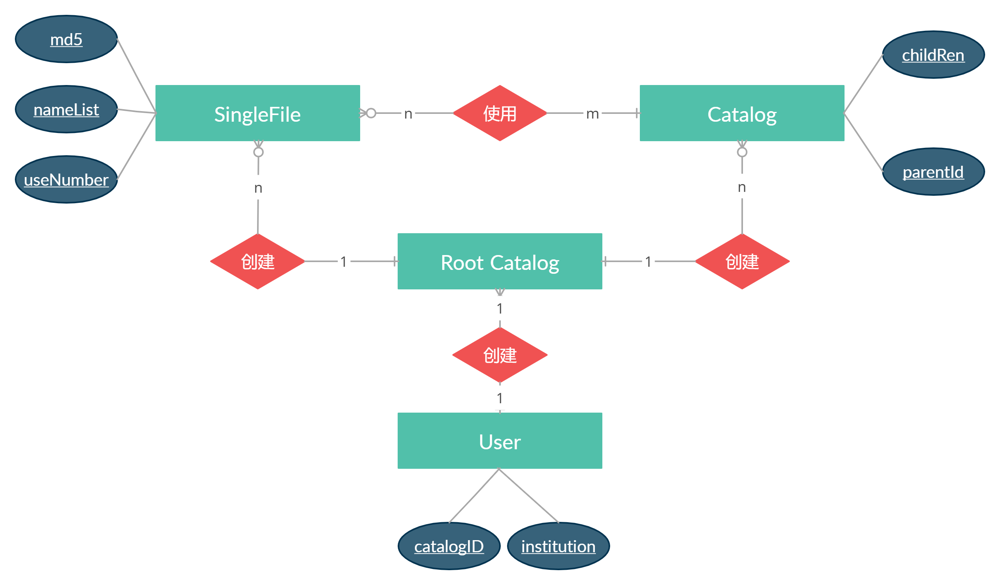

# 长三角数据中心后台

[toc]

## 摘要

这项工作的主要目的是注册登录一些用户，用户能上传数据并进行管理，上传的数据可以和数据中心的数据之间能做出一些数据分析。

- 可能是海量异构数据
- 可能是计算密集型（但是可能性不大）
- 如何评判数据的价值

## 设计

海量异构数据：采用分布式文件系统和对象存储方式，初步考虑 [minIO](http://www.minio.org.cn/overview.shtml) 的框架

计算密集型：没有想法，不知道 minIO 和 Flink 的耦合度咋样，大数据计算没有任何基础,,,


目前工作：现在只考虑数据存放在单个服务器上的情况，数据利用系统自带的文件系统管理，数据元数据及用户信息存储在 Mongo 数据库中，数据库设计如下：



<div align='center'>数据管理设计</div>

## 表设计

#### base

Base: User、Catalog

```java
public class User {
    @Id
    String id;
    String catalogID;
    String name;
    String password;
    String institution;     // 用户可能了来自不同的机构
    Date date;
}
```

<div align='center'>User</div>

```java
public class ChildrenData {
    String type;    // file or folder
    String name;
    String id;
}

public class Catalog {
    @Id
    String id;
    String parentId;
    List<ChildrenData> children;

    String userId;
    String name;
    int level;
    Date date;
}
```

<div align='center'>Catalog</div>

#### data

data: singleFile、PublicData

```java
public class SingleFile {
    @Id
    String id;
    String md5;
    Map<String, String> nameList;
    int parentNumber;   // 被指向的次数，刚开始次数是 1，当次数归 0 的时候删除文件
    int size;
    int useNumber;      // 每次访问次数加一，某段时间内使用次数到达多少次，将其认为资源
    Date date;
    Boolean isResource;
}
```

<div align='center'>singleFile</div>

```java
public class PublicData extends SingleFile {
    String name;
}
```

<div align='center'>publicData</div>

